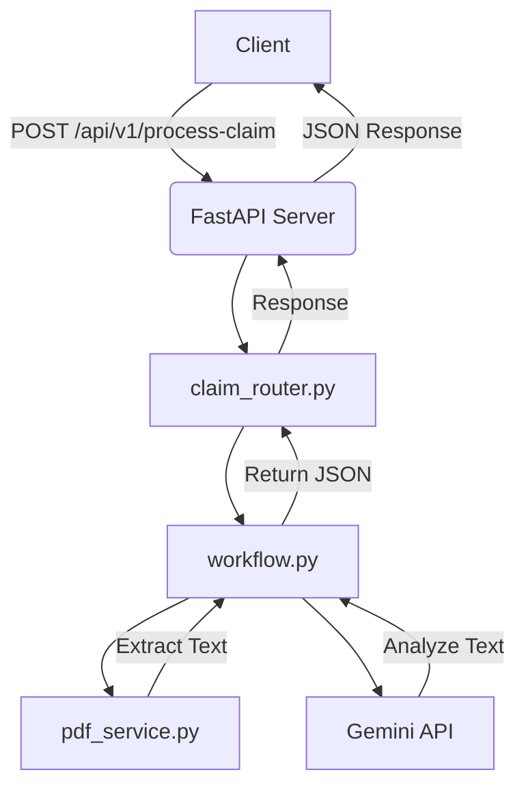

# HealthPay Claim Processor

## Overview
A FastAPI-based API for processing healthcare claims by extracting and validating data from PDF documents (e.g., hospital bills, discharge summaries) using Gemini and LangGraph.

## Architecture Diagram

## Architecture

- **FastAPI Endpoint**: `/process-claim` handles PDF uploads and orchestrates the workflow.
- **Agents**:
  - **Classifier**: Uses Gemini LLM to classify documents as `bill`, `discharge_summary`, or `id_card` based on filename and content.
  - **Extractor**: Extracts structured data (e.g., hospital_name, total_amount) using Gemini.
  - **Bill Agent**: Validates bill-specific fields like `total_amount`.
  - **Discharge Agent**: Validates discharge summary fields like dates.
  - **Validator**: Checks for missing documents and discrepancies, determines claim decision.
- **Orchestration**: LangGraph manages the workflow: classify → process → validate.
- **Services**: PDF text extraction using PyPDF2.

## AI Tool Usage

- **Cursor.ai**: Used for scaffolding FastAPI setup, LangGraph workflow, and code structure suggestions.
- **Gemini**: Used for document classification and structured data extraction.
- **ChatGPT**: Refined LLM prompts to ensure structured JSON output.
- **Claude**: Assisted in debugging validation logic and handling edge cases.

## Example Prompts

1. **Classification Prompt** (Gemini):
   ```
   Classify the following document as 'bill', 'discharge_summary', or 'id_card'.
   Filename: {file_path}
   Content (first 500 chars): {text[:500]}
   Return only the document type as a single word.
   ```
2. **Extraction Prompt** (Gemini):
   ```
   Extract structured data from the following {doc_type} document.
   Text: {text[:2000]}
   For 'bill', extract: hospital_name, total_amount, date_of_service
   For 'discharge_summary', extract: patient_name, diagnosis, admission_date, discharge_date
   For 'id_card', extract: patient_name
   Return JSON: { "type": "{doc_type}", ... }
   Ensure all fields are strings or numbers, and omit fields if data is missing.
   ```
3. **Validation Debugging** (Claude):
   ```
   Help me debug this validation logic: [code snippet]. It’s not catching missing fields correctly.
   ```

## Setup Instructions

1. Clone the repository.
2. Install dependencies: `pip install -r requirements.txt`
3. Set `GEMINI_API_KEY` in `.env`.
4. Run the app: `uvicorn app.main:app --host 0.0.0.0 --port 8000`
5. Test the endpoint using a tool like Postman with PDF uploads to `http://localhost:8000/process-claim`.

## Docker Setup

1. Build the image: `docker build -t healthpay-claim-processor .`
2. Run the container: `docker run -p 8000:8000 --env-file .env healthpay-claim-processor`

## Testing

- Unit tests are in `tests/test_main.py`.
- Run tests: `pytest`

## Bonus Features

- **Docker**: Included `Dockerfile` for containerization.
- **Tests**: Basic unit tests for the `/process-claim` endpoint.
- **Error Handling**: Robust error handling for PDF processing and LLM calls.

## Tradeoffs and Failures

- **LLM Limitations**: Gemini’s token limits required truncating PDF text to 2000 characters for extraction.
- **Error Handling**: Added try-catch blocks to handle LLM or PDF failures, but edge cases like corrupted PDFs may need more robust handling.
- **Scalability**: The current setup is single-threaded; for production, consider adding Redis for caching or a task queue for async processing.
