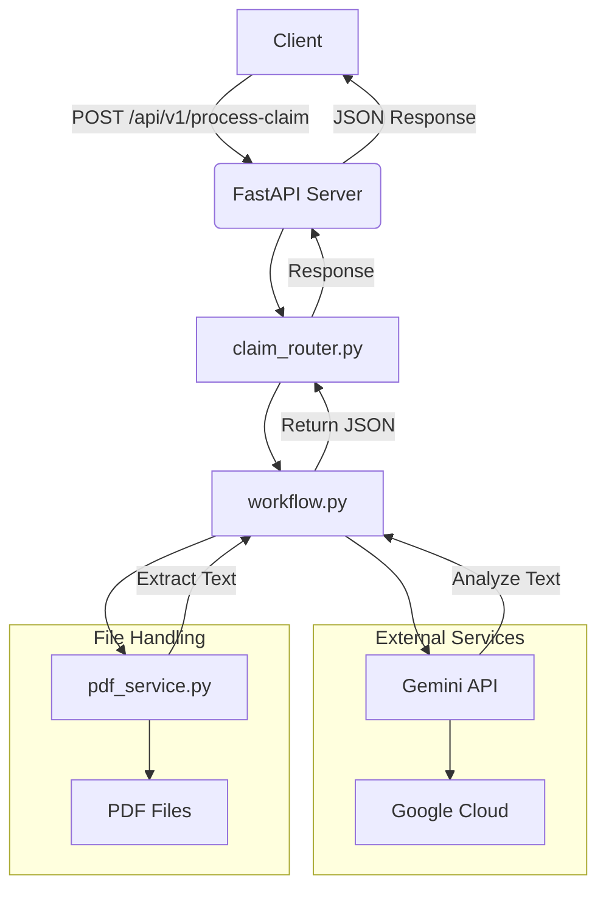

# 🏥 HealthPay Claim Processor

## 📖 Overview

The **HealthPay Claim Processor** is a FastAPI-based REST API designed to process healthcare claims by extracting and validating data from PDF documents, such as hospital bills and discharge summaries. It leverages Google’s Gemini API for intelligent text analysis, PyPDF2 for PDF text extraction, and LangGraph for workflow orchestration. The application is containerized using Docker, ensuring portability and scalability, and includes unit tests to validate functionality.

---

## ✨ Features

- **PDF Processing**: Extracts text from uploaded PDFs (e.g., bills, discharge summaries).
- **Data Extraction**: Uses Gemini API to parse and extract relevant claim details (e.g., hospital name, amount, patient diagnosis).
- **Validation**: Performs basic validation of extracted data, returning a `processed` or `failed` status.
- **REST API**: Exposes endpoints for claim processing (`/api/v1/process-claim`) and health checks (`/`).
- **Docker Support**: Containerized with a secure `python:3.10-slim` base image.
- **Unit Tests**: Includes `pytest`-based tests to ensure endpoint reliability.
- **Error Handling**: Robust handling of invalid PDFs or API errors.

---

## 🏗️ Architecture Diagram

## 📌 Diagram Explanation

- **Client**: Sends PDF files via a POST request to `/api/v1/process-claim`.
- **FastAPI Server**: Receives requests and routes them to `claim_router.py`.
- **claim_router.py**: Defines the `/process-claim` endpoint.
- **workflow.py**: Orchestrates processing, calling `pdf_service.py` and Gemini API.
- **pdf_service.py**: Extracts text from PDFs using PyPDF2.
- **Gemini API**: Analyzes text to extract claim details (e.g., amount, diagnosis).
- **Response**: Returns JSON with extracted data and validation status.

---

## ⚙️ Dependencies

- **Python**: 3.10  
- **FastAPI**: 0.115.0  
- **Uvicorn**: 0.30.6  
- **PyPDF2**: 3.0.1  
- **Google Generative AI**: 0.8.3  
- **LangGraph**: 0.2.14  
- **Pydantic**: 2.9.2  
- **Python-Multipart**: 0.0.9  
- **Pytest**: 8.3.3  
- **Python-Dotenv**: 1.0.1  
- **Docker**: For containerization  
- **Trivy**: For vulnerability scanning  

---

## 🚀 Setup Instructions

### ✅ Prerequisites

Ensure the following are installed:

- Python 3.10  
- Docker (optional, for containerized deployment)  
- Git  
- Gemini API key (obtain from [Google AI Studio](https://aistudio.google.com/app/apikey))  

---
